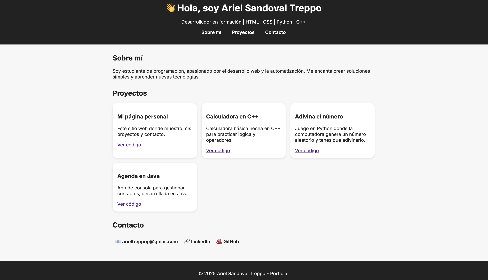

# 🌐 Portfolio Personal de Ariel Sandoval Treppo

¡Bienvenido a mi página personal! Este proyecto es mi **portfolio online**, un espacio donde muestro quién soy, qué tecnologías manejo y algunos de los proyectos que he desarrollado mientras aprendo programación.

## 📖 Descripción
Este sitio web fue creado con **HTML5 y CSS3** como parte de mi formación en desarrollo web. Mi objetivo es tener un lugar centralizado para:
- Presentarme profesionalmente.
- Mostrar mis proyectos con enlaces directos a su código.
- Practicar buenas prácticas de desarrollo, versionado en GitHub y diseño responsivo.

El sitio es **simple, rápido y adaptable a cualquier dispositivo** (celular, tablet o PC) y está pensado para crecer con el tiempo, incorporando más proyectos, mejoras de diseño y funcionalidades como un formulario de contacto.

## 🚀 Demo en vivo
Puedes ver la página funcionando aquí:
👉 [Demo en GitHub Pages](https://cjunior7.github.io/mi-pagina-personal/)

## 🛠️ Tecnologías utilizadas
- **HTML5** para la estructura
- **CSS3** para los estilos y el diseño responsivo
- **GitHub Pages** para la publicación online

## 📂 Estructura del proyecto
```bash
mi-pagina-personal/
├── index.html   # Página principal con todo el contenido
├── style.css    # Estilos personalizados
└── README.md    # Documentación del proyecto
```

## 📷 Captura de pantalla


## 📥 Instalación y uso
1. Clona este repositorio:
```bash
git clone https://github.com/cjunior7/mi-pagina-personal.git
```
2. Abre el archivo `index.html` en cualquier navegador.

No requiere instalación de dependencias ni compilación.

## 📌 Próximas mejoras
- [ ] Agregar animaciones con JavaScript
- [ ] Incorporar un formulario de contacto funcional
- [ ] Añadir versión en inglés
- [ ] Incluir más proyectos y capturas de pantalla

## 👤 Autor
**Ariel Sandoval Treppo**
- 📧 [arieltreppop@gmail.com](mailto:arieltreppop@gmail.com)
- 🐙 [GitHub](https://github.com/cjunior7)
- 🔗 [LinkedIn](https://www.linkedin.com)

---
⭐ Si te gustó este proyecto, ¡considera darle una estrella en GitHub!

👉 [Ver la página online](https://cjunior7.github.io/mi-pagina-personal/)
